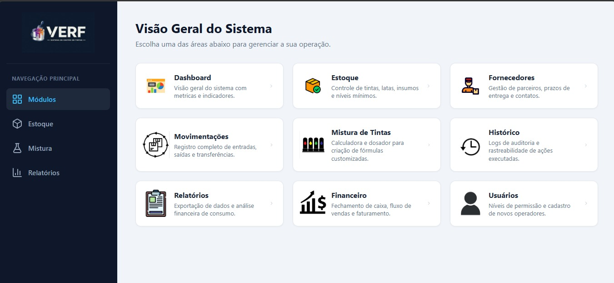

# VERF System


API REST para controle de estoque, receitas e produção de tintas, com rastreabilidade das movimentações.

Projeto acadêmico em desenvolvimento (Projeto Integrador). Este README descreve o que existe hoje no código — o planejamento completo está no [ROADMAP.md](ROADMAP.md).

---

## Sumário

- [O problema](#o-problema)
- [Domínios do sistema](#domínios-do-sistema)
- [Funcionalidades disponíveis](#funcionalidades-disponíveis)
- [Como executar](#como-executar)
- [API](#api)
- [Arquitetura](#arquitetura)
- [Banco de dados](#banco-de-dados)
- [Estado do projeto](#estado-do-projeto)
- [Testes](#testes)
- [Frontend](#frontend)
- [Roadmap](#roadmap)
- [Equipe](#equipe)
- [Convenções do repositório](#convenções-do-repositório)
- [Licença](#licença)

---

## O problema

Em uma fábrica ou distribuidora de tintas, o controle costuma ser feito em planilha ou no papel. O resultado é sempre o mesmo: ninguém sabe ao certo quanto existe de cada tinta, quem movimentou o quê, qual receita gerou determinada produção, nem quanto se perdeu no caminho.

O VERF centraliza esses registros em um banco único e guarda o histórico de cada operação. A regra de negócio prevista é que **o saldo de estoque não seja editado diretamente**: ele deve existir como consequência das movimentações registradas, e cada movimentação sabe quem a fez, quando, por quê e de qual produção veio.

---

## Domínios do sistema

| Domínio | Responsabilidade |
|---|---|
| Fornecedor | Empresas que fornecem as tintas compradas |
| Tinta | Cadastro de tintas, compradas ou produzidas, com código e cor hexadecimal |
| Estoque | Saldo atual de cada tinta |
| Movimentação | Entradas, saídas e ajustes de estoque |
| Receita | Fórmula que define qual tinta é produzida e seu valor por litro |
| Itens da receita | Tintas usadas como matéria-prima e sua proporção percentual |
| Produção | Registro de fabricação a partir de uma receita |
| Funcionário | Pessoas que operam o sistema, com nível de acesso |
| Usuário | Vínculo de acesso de um funcionário ao sistema |
| Log de acessos | Registro de tentativas de acesso |
| Financeiro | Receita, compras, perdas e saldo informados por data de referência |

---

## Funcionalidades disponíveis

Operações que a API atende hoje:

- Cadastro, listagem, consulta por ID e inativação lógica de **fornecedores**, **funcionários** e **usuários**
- Cadastro, listagem e consulta de **tintas**, vinculadas a um fornecedor
- Cadastro, listagem e consulta de **saldos de estoque**, vinculados a uma tinta
- Registro, listagem e consulta de **movimentações** (entrada, saída, ajuste), vinculadas a estoque, funcionário e, opcionalmente, a uma produção
- Cadastro, listagem e consulta de **receitas** e de seus **itens**, com proporção percentual
- Registro, listagem e consulta de **produções**, vinculadas a receita e funcionário
- Registro, listagem e consulta de **lançamentos financeiros** e de **logs de acesso**

A inativação é lógica (`ativo = false`): nenhum registro é removido do banco, preservando o histórico.

> **Importante:** o registro de movimentação ainda não recalcula o saldo em `tb_estoque`, e a produção ainda não consome matéria-prima automaticamente. Essas regras são o foco atual do desenvolvimento. Veja [Estado do projeto](#estado-do-projeto).

---

## Como executar

**Pré-requisitos:** Java 21, PostgreSQL e Git. O Maven não precisa estar instalado — use o wrapper.

**1. Clone o repositório**

```bash
git clone https://github.com/JoaoVieiraL/verf-system.git
cd verf-system
```

**2. Crie o banco no PostgreSQL**

```sql
CREATE DATABASE "dbVerf";
```

A URL está fixa no `application.yaml` como `jdbc:postgresql://localhost:5432/dbVerf`. Para usar outro host, porta ou nome de banco, é preciso alterar o arquivo.

**3. Defina as variáveis de ambiente**

O projeto **não possui biblioteca de leitura de arquivo `.env`**. O `.env.example` serve apenas como referência dos nomes: as variáveis precisam ser exportadas no terminal ou configuradas na run configuration da IDE.

Linux e macOS:

```bash
export DATABASE_USERNAME=postgres
export DATABASE_PASSWORD=sua_senha
```

Windows (PowerShell):

```powershell
$env:DATABASE_USERNAME="postgres"
$env:DATABASE_PASSWORD="sua_senha"
```

IntelliJ IDEA: *Edit Configurations* → `VerfSApplication` → campo **Environment variables** → `DATABASE_USERNAME=postgres;DATABASE_PASSWORD=sua_senha`

**4. Execute**

```bash
./mvnw spring-boot:run
```

A API sobe em `http://localhost:8090`. Na primeira execução o Hibernate cria as tabelas (`ddl-auto: update`).

**5. Abra a documentação interativa**

- Swagger UI: `http://localhost:8090/swagger-ui/index.html`
- Especificação OpenAPI: `http://localhost:8090/v3/api-docs`

### Configuração

| Variável | Descrição |
|---|---|
| `DATABASE_USERNAME` | Usuário do PostgreSQL |
| `DATABASE_PASSWORD` | Senha do PostgreSQL |

Nenhuma credencial real está versionada: o `.env` está no `.gitignore`.

Outras configurações do `application.yaml`: `server.port: 8090`, `ddl-auto: update`, `show-sql: true` e `format_sql: true`.

---

## API

Base: `http://localhost:8090`

Observações sobre o padrão atual, mantido aqui como está no código:

- Não há prefixo `/api` e todos os endpoints estão abertos
- Os recursos usam nome no singular com inicial maiúscula
- `Tinta` está em `/v2`; os demais estão em `/v1`
- O POST retorna `201 Created` com corpo vazio — não devolve o recurso criado nem o header `Location`
- Registro inexistente retorna `500`, não `404` (veja [Estado do projeto](#estado-do-projeto))

A padronização das rotas para `/api/v1`, com recursos no plural, é um item do roadmap.

### Fornecedor

| Método | Endpoint | Descrição |
|---|---|---|
| GET | `/v1/Fornecedor` | Lista fornecedores |
| GET | `/v1/Fornecedor/{id}` | Busca por ID |
| POST | `/v1/Fornecedor` | Cadastra |
| DELETE | `/v1/Fornecedor/{id}` | Inativa (`ativo = false`) |

POST /v1/Fornecedor
```json
{
  "cnpj": "00000000000191",
  "nome": "Química Exemplo Ltda",
  "telefone": "11999999999",
  "email": "contato@exemplo.com",
  "ativo": true
}
```

O CNPJ é validado com `@CNPJ` do Hibernate Validator e é único.

### Funcionário

| Método | Endpoint | Descrição |
|---|---|---|
| GET | `/v1/Funcionario` | Lista funcionários |
| GET | `/v1/Funcionario/{id}` | Busca por ID |
| POST | `/v1/Funcionario` | Cadastra |
| DELETE | `/v1/Funcionario/{id}` | Inativa |

`nivelDeAcesso` aceita `ADMIN`, `USER_N1` ou `USER_N2`.

### Usuário

| Método | Endpoint | Descrição |
|---|---|---|
| GET | `/v1/Usuario` | Lista usuários |
| GET | `/v1/Usuario/{id}` | Busca por ID |
| POST | `/v1/Usuario` | Vincula um funcionário como usuário (`idFuncionario`) |
| DELETE | `/v1/Usuario/{id}` | Inativa |

### Tinta

| Método | Endpoint | Descrição |
|---|---|---|
| GET | `/v2/Tinta` | Lista tintas |
| GET | `/v2/Tinta/{id}` | Busca por ID |
| POST | `/v2/Tinta` | Cadastra |


POST "/v2/Tinta"
```json
{
  "nome": "Azul Royal",
  "numeroHexadecimal": "#1E3A8A",
  "codigo": "TNT-0001",
  "origem": "COMPRADA",
  "ativo": true,
  "idFornecedor": 1
}
```

`origem` aceita `COMPRADA` ou `PRODUZIDA`. O `TintaService` possui o método `inativar`, mas ele ainda não está exposto em nenhum endpoint.

### Estoque

| Método | Endpoint | Descrição |
|---|---|---|
| GET | `/v1/Estoque` | Lista saldos |
| GET | `/v1/Estoque/{id}` | Busca por ID |
| POST | `/v1/Estoque` | Cria o saldo de uma tinta |

POST /v1/Estoque
```json
{ "idTinta": 1, "quantidade": 100 }
```

Este POST existe em caráter temporário, para permitir os testes enquanto a regra de movimentação não está implementada. A intenção é removê-lo: o saldo deve mudar apenas como consequência de uma movimentação.

### Movimentação de estoque

| Método | Endpoint | Descrição |
|---|---|---|
| GET | `/v1/MovimentacaoEstoque` | Lista movimentações |
| GET | `/v1/MovimentacaoEstoque/{id}` | Busca por ID |
| POST | `/v1/MovimentacaoEstoque` | Registra uma movimentação |

POST /v1/MovimentacaoEstoque
```json
{
  "idEstoque": 1,
  "idFuncionario": 1,
  "idProducao": null,
  "tipoMovimentacao": "ENTRADA",
  "quantidadeAnterior": 0,
  "quantidadeMovimentada": 100,
  "quantidadePosterior": 100,
  "observacao": "Compra inicial",
  "dataMovimentacao": "2026-09-14"
}
```

`tipoMovimentacao` aceita `ENTRADA`, `SAIDA` ou `AJUSTE`. `idProducao` é opcional.

As três quantidades são gravadas exatamente como enviadas e o saldo em estoque **não** é alterado pela aplicação. A implementação prevista remove `quantidadeAnterior` e `quantidadePosterior` do corpo da requisição e passa a calculá-las no service.

### Receita e itens da receita

| Método | Endpoint | Descrição |
|---|---|---|
| GET | `/v1/Receita` | Lista receitas |
| GET | `/v1/Receita/{id}` | Busca por ID |
| POST | `/v1/Receita` | Cadastra (`idTintaResultante`, `idCriadoPor`) |
| GET | `/v1/ItensReceita` | Lista itens |
| GET | `/v1/ItensReceita/{id}` | Busca por ID |
| POST | `/v1/ItensReceita` | Cadastra (`idReceita`, `idTintaMateriaPrima`, `proporcaoPercentual`) |

A soma das proporções de uma receita ainda não é validada.

### Produção

| Método | Endpoint | Descrição |
|---|---|---|
| GET | `/v1/Producoes` | Lista produções |
| GET | `/v1/Producoes/{id}` | Busca por ID |
| POST | `/v1/Producoes` | Registra (`idReceita`, `idFuncionario`, `volumeProduzido`, `dataProducao`) |

### Financeiro e log de acessos

| Método | Endpoint | Descrição |
|---|---|---|
| GET | `/v1/Financeiro` | Lista lançamentos |
| GET | `/v1/Financeiro/{id}` | Busca por ID |
| POST | `/v1/Financeiro` | Registra lançamento |
| GET | `/v1/LogAcessos` | Lista logs |
| GET | `/v1/LogAcessos/{id}` | Busca por ID |
| POST | `/v1/LogAcessos` | Registra log (data/hora preenchida pelo servidor) |

O `LogAcessosDto` é o único DTO que ainda recebe a entidade `UsuarioEntity` aninhada em vez do ID. Ele será refeito junto com a geração automática do log a partir do evento de autenticação.

---

## Arquitetura

```text
Controller  →  recebe a requisição HTTP e delega
    ↓
Service     →  resolve as entidades relacionadas pelo ID e monta a entidade
    ↓
Repository  →  Spring Data JPA (JpaRepository)
    ↓
PostgreSQL
```

Decisões da implementação atual:

- **Injeção por construtor**, com `@RequiredArgsConstructor` do Lombok
- **DTOs de entrada por recurso.** Relacionamentos chegam como ID (`idTinta`, `idFornecedor`, `idReceita`) e são resolvidos no service com `findById`, o que garante que o registro referenciado existe antes de gravar. A única exceção é o `LogAcessosDto`
- **Auditoria automática.** `criadoEm` e `atualizadoEm` são preenchidos por `@PrePersist` e `@PreUpdate`, nunca pelo cliente
- **Chaves primárias padronizadas** como `Long` em todas as entidades
- **Sem DTO de saída.** As respostas serializam as entidades JPA diretamente, o que expõe campos internos — inclusive o `senha_hash` do funcionário
- **Sem tratamento de erro.** Os services lançam `RuntimeException` quando não encontram o registro; sem handler global, isso vira HTTP 500

### Estrutura de pastas

```text
verf-system/
├── frontend/                       # páginas estáticas, ainda não integradas
├── src/
│   ├── main/
│   │   ├── java/com/verf_system/verfS/
│   │   │   ├── VerfSApplication.java
│   │   │   ├── configuration/      # SecurityConfig
│   │   │   ├── controller/         # 11 REST controllers
│   │   │   ├── database/
│   │   │   │   ├── entity/         # entidades JPA e enums
│   │   │   │   └── repository/     # interfaces JpaRepository
│   │   │   ├── dto/                # DTOs de entrada
│   │   │   └── service/            # regras de aplicação
│   │   └── resources/
│   │       └── application.yaml
│   └── test/
│       └── java/com/verf_system/verfS/VerfSApplicationTests.java
├── .env.example
├── pom.xml
├── README.md
└── ROADMAP.md
```

### Tecnologias

Confirmadas no `pom.xml`:

| | |
|---|---|
| Linguagem | Java 21 |
| Framework | Spring Boot 4.0.8 |
| Web | Spring Web MVC (`spring-boot-starter-webmvc`) |
| Persistência | Spring Data JPA / Hibernate |
| Banco | PostgreSQL |
| Validação | Bean Validation (`spring-boot-starter-validation`) |
| Segurança | Spring Security (presente, sem autenticação implementada) |
| Documentação | springdoc-openapi 3.1.0 |
| Utilitários | Lombok, Spring Boot DevTools |
| Build | Maven, com wrapper `mvnw` |

O `spring-boot-starter-batch` está declarado no `pom.xml` mas **não possui nenhum job implementado**. A remoção da dependência está no roadmap.

---

## Banco de dados

PostgreSQL, acessado via Spring Data JPA. O schema é gerado pelo Hibernate com `ddl-auto: update` — **não há migrations** (Flyway ou Liquibase) no projeto. A adoção do Flyway está no roadmap.

Tabelas: `tb_fornecedor`, `tb_tinta`, `tb_estoque`, `tb_movimentacao`, `tb_receita`, `tb_itens_receita`, `tb_producoes`, `tb_funcionario`, `tb_usuario`, `tb_log_acessos`, `tb_financeiro`.

### Relacionamentos

```text
Fornecedor   1 ──── N  Tinta
Tinta        1 ──── 1  Estoque
Tinta        1 ──── N  Receita           (tinta resultante)
Receita      1 ──── N  ItensReceita
ItensReceita N ──── 1  Tinta             (matéria-prima)
Receita      1 ──── N  Producoes
Producoes    N ──── 1  Funcionario
Estoque      1 ──── N  Movimentacao
Movimentacao N ──── 1  Funcionario
Movimentacao N ──── 1  Producoes         (opcional)
Funcionario  1 ──── 1  Usuario
Usuario      1 ──── N  LogAcessos
```

`tb_itens_receita` possui constraint de unicidade em (`id_receita`, `id_tinta`), impedindo a mesma matéria-prima repetida na mesma receita.


---

## Estado do projeto

Esta seção existe para que ninguém precise ler o código para saber o que funciona.

### Implementado

- Estrutura em camadas Controller → Service → Repository para os 11 domínios
- Entidades JPA com relacionamentos, enums e auditoria automática de datas
- Listagem, busca por ID e cadastro em todos os recursos
- Resolução das entidades relacionadas pelo ID enviado no DTO
- Inativação lógica de fornecedor, funcionário e usuário
- Persistência em PostgreSQL com schema gerado pelo Hibernate
- springdoc-openapi disponível nos caminhos padrão

### Parcialmente implementado

| Item | Situação |
|---|---|
| Validação | As anotações (`@NotBlank`, `@Size`, `@Email`, `@CNPJ`) estão nas entidades, não nos DTOs, e os controllers não usam `@Valid`. A validação só ocorre no flush do Hibernate e a falha retorna erro genérico |
| Spring Security | O `SecurityConfig` existe, mas libera todas as rotas com `permitAll()`. Não há autenticação |
| Inativação de tintas | O método existe no service, sem endpoint que o exponha |
| DTOs por ID | Dez dos onze DTOs recebem ID; o `LogAcessosDto` ainda recebe a entidade |
| Frontend | Existe, não integrado à API |

### Não implementado

- **Regra de negócio de estoque.** A movimentação é apenas registrada: ela não recalcula nem atualiza a quantidade em `tb_estoque`, e as quantidades anterior e posterior são informadas pelo cliente
- **Regra de negócio de produção.** A produção não consome matéria-prima nem gera movimentações automaticamente
- **Atualização de registros.** Não existe nenhum `PUT` ou `PATCH` na aplicação
- **Tratamento global de exceções.** Sem `@RestControllerAdvice`, exceções de domínio ou respostas de erro padronizadas
- **DTOs de resposta.** Os controllers retornam as entidades JPA
- **Hash de senha.** O campo `senha_hash` é gravado exatamente como recebido
- **Autenticação e autorização** por nível de acesso, e registro automático de log de acesso
- **Controle transacional explícito** (`@Transactional`)
- **Paginação e filtros** nas listagens
- **Testes** além do `contextLoads`

### Aviso de segurança

**A API não está protegida e não deve ser exposta na internet no estado atual.** O `SecurityConfig` desabilita CSRF e aplica `permitAll()` a todas as rotas, de forma intencional e temporária, para permitir os testes dos CRUDs durante o desenvolvimento. Não há `PasswordEncoder`, e como as respostas serializam as entidades, o `GET /v1/Funcionario` devolve o campo `senha_hash`.

---

## Testes

Existe apenas a classe `VerfSApplicationTests`, com o teste `contextLoads`, que verifica se o contexto do Spring sobe. Ele exige um PostgreSQL disponível e as variáveis de ambiente definidas, já que o datasource é o mesmo da aplicação — ou seja, `./mvnw test` falha em uma máquina sem banco local.

As dependências de teste (`spring-boot-starter-webmvc-test`, `spring-boot-starter-data-jpa-test`, `spring-boot-starter-security-test`) já estão no `pom.xml`. A adoção de Testcontainers e a escrita dos testes de service e controller estão no roadmap.

---

## Frontend

A pasta `frontend/` contém páginas estáticas em HTML, CSS e JavaScript puro — login, recuperação de senha e um menu de módulos — além das imagens da interface.

Ela ainda **não funciona com a API**. O `app.js` chama `http://localhost:8080/v2/Usuario/login` e a página de recuperação chama `/api/auth/esqueci-senha`; nenhum desses endpoints existe no backend, e a API roda na porta 8090. A integração depende de três coisas: implementar a autenticação, configurar CORS e alinhar o contrato das rotas.



---

## Roadmap

O [ROADMAP.md](ROADMAP.md) traz o planejamento técnico completo, em 12 blocos priorizados. Resumo da ordem de execução:

**Em andamento**

1. Correções de modelagem e persistência que impedem operações básicas
2. Exceções de domínio, `@RestControllerAdvice` e `@Valid` nos DTOs

**Próximos**

3. Regra de estoque: movimentação como única via de alteração de saldo, com `@Transactional` e bloqueio de saída maior que o saldo
4. Produção consumindo matéria-prima e gerando movimentações, em transação única
5. DTOs de resposta, retirando `senha_hash` e as entidades JPA do contrato
6. Padronização REST: prefixo `/api/v1`, recursos no plural, e endpoints de atualização

**Depois**

7. Autenticação, autorização por nível de acesso e hash de senha
8. Flyway, índices e correção dos N+1
9. Testes automatizados de service e controller
10. Docker, CI/CD e observabilidade
11. Integração do frontend com a API

---

## Equipe

| Integrante                                                 | Responsabilidade                             |
|------------------------------------------------------------|----------------------------------------------|
| [João Antonio Vieira Lima](https://github.com/JoaoVieiraL) | Backend — modelagem, API e regras de negócio |
| *Alison Mariano*                                           | *Backend — modelagem, API e regras de negócio*                                           |
| Renan Miranda                                              | Frontend — interface e integração            |
| *Daniel Caitano*                                           | *Frontend — interface e integração*          |
| *Ricardo Jhony*                                            | *Frontend — interface e integração*          |


---

## Convenções do repositório

Os commits seguem o padrão [Conventional Commits](https://www.conventionalcommits.org/pt-br/), com escopo indicando a parte do projeto:

```text
fix(backend): preencher datas de auditoria via callbacks JPA
refactor(backend): padronizar o tipo das chaves primárias como Long
feat(frontend): ajusta ícone do estoque e estilos da sidebar
chore(backend): remover código morto da classe principal
```

Tipos em uso: `feat`, `fix`, `refactor`, `chore`, `docs`, `test`, `style`.

O trabalho acontece diretamente na branch `main`, com os dois integrantes sincronizando por `pull` antes de cada sessão. A adoção de branches por feature e Pull Requests está prevista junto com o CI.

O acompanhamento das tarefas é feito no Jira, com um épico por bloco do roadmap.

---

## Licença

Distribuído sob a licença MIT. Veja o arquivo [LICENSE](LICENSE).

Projeto desenvolvido para fins acadêmicos, como Projeto Integrador.

